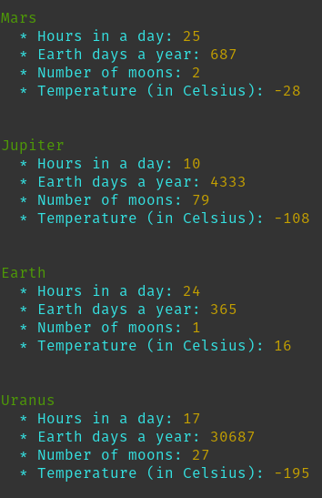

# CLI Planets
Serves planets data on your terminal

### Screenshot

### Why does this project exist
To practice the following in Rust:
- Talking to an API
- Parsing json
- Print on terminal colourfully

### API used
- http://planet5.herokuapp.com/all
- API source code: https://github.com/w3bdev1/planets-api

### Crates used
- `ureq`: For talking to the API
- `serde_json`: For parsing json data
- `colour`: For printing on terminal with colourful text
